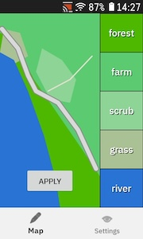
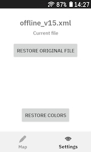
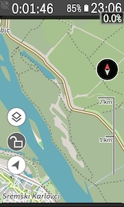
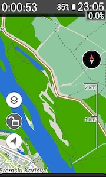

## KxTheme

**KxTheme is a simple theme editor for the Hammerhead Karoo.**

It lets you:
- open the latest Karoo offline theme file
- change map colors in the app
- apply the new colors to the theme XML
- restore the original file from a backup

## Installation
Karoo 3
1. [LINK to APK](https://github.com/itxsvv/kxtheme/releases/latest/download/app-release.apk)\
   Share this link with the Hammerhead Companion App.

Karoo 2:

1. Download the APK from the [releases page](https://github.com/itxsvv/kxtheme/releases)
2. Set up your Karoo for sideloading. DC Rainmaker has a great [step-by-step guide](https://www.dcrainmaker.com/2021/02/how-to-sideload-android-apps-on-your-hammerhead-karoo-1-karoo-2.html).
3. Install the app by running `adb install app-release.apk`.

## Screens
Editor  

  
Original vs Themed  

## Important

After a theme change, the Karoo may work slowly for the first 30 seconds.  
This is normal.  
It is recommended to:
- restart the device
- or wait a little before using it

## How To Use

1. Open the app.
2. Give file access permission if Android asks for it.
3. Go to the `Map` screen.
4. Tap a color block on the right side.
5. Pick a new color.
6. Press `Apply`.

After `Apply`, the app updates the current theme XML file.

## Restore Original File

On the `Settings` screen you can use:
- `Restore original file`  
This copies the `.bak` file back over the current XML file.  
The backup file is kept and is not deleted.  

## How Theme File Detection Works

The app looks in `/sdcard/` for files with this format:  
`offline_v<number>.xml`
Example:  
`offline_v15.xml`
If there are multiple files, the app uses the file with the biggest number.  
Example:
- `offline_v8.xml`
- `offline_v15.xml`
- `offline_v20.xml`

The app will use:

`offline_v20.xml`

## How Backup Files Work

When the app starts:
- it finds the latest `offline_v<number>.xml`
- it checks whether a backup file already exists

The backup file format is:
`offline_v<number>.xml.bak`
Example:  
`offline_v20.xml.bak`  
If the backup file does not exist, the app creates it automatically.  
If a new theme XML appears and its `.bak` file is missing, the app shows this message:  
`A new theme file!.`    
`Please APPLY it again.`  

## Notes

- `Apply` changes the current XML file.
- `Restore original file` restores the XML from the backup.
- `Restore colors` restores the default colors inside the app.
